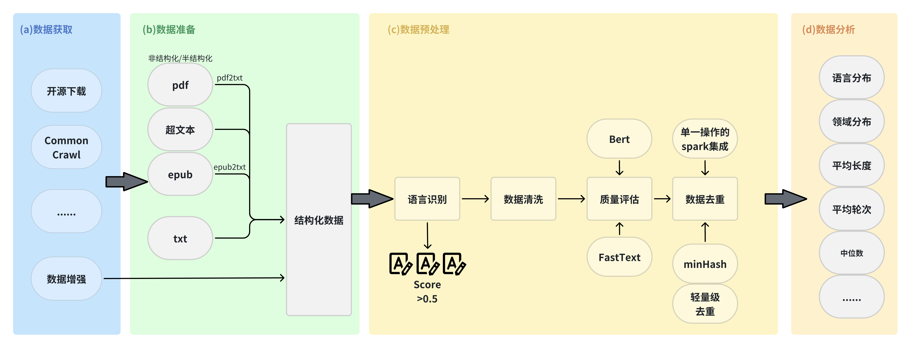

<div id=top align="center">

#####

</div>

-----------------------------------------------------------------------
&emsp;&emsp;Brikit_data_process集成了包含数据获取、数据准备、数据预处理、数据分析等4个阶段的多个数据处理工具与算法，为自然语言处理、计算机视觉等领域的模型训练与部署提供了数据层面的有力支撑。

Brikit_data_process支持以下特性：

* 实现多种原始格式数据的高质量内容提取，极大降低处理成本

* 提供大模型微调数据透视功能

* 一站式高效分布式数据处理功能

完整的pipeline流程以及功能如下图：


--------------------------------------------------------------------------------


- [1、安装](#1安装)
- [2、使用](#2使用)
  - [2.1、数据获取阶段](#21数据获取阶段)
  - [2.2、数据准备阶段](#22数据准备阶段)
  - [2.3、数据预处理阶段](#23数据预处理阶段)
    - [2.3.1、语言识别](#231语言识别)
    - [2.3.2、数据清洗](#232数据清洗)
    - [2.3.3、质量评估](#233质量评估)
    - [2.3.4、数据去重](#234数据去重)
  - [2.4、数据分析阶段](#24数据分析阶段)
- [3、配置](#3配置)
- [4、联系](#4联系)
- [5、参考项目](#5参考项目)

## 1、安装

  requirements.txt 文件下，是FlagData项目所有的依赖包

```bash
pip install -r requirements.txt
```

## 2、使用

### 2.1、数据获取阶段

&emsp;&emsp;我们提供了data_gen模块，利用gpt接口，以三种不同策略，构建一系列针对不同能力的单轮SFT数据，如下所示：

+ ImitateGenerator：以若干案例样本为模板，扩增数据。支持同时生成多种语言数据。
+ AbilityExtractionGenerator: 利用LLM接口，归纳出若干案例样本中包含的能力。根据这个能力集合，生成新样本和答案。
+ AbilityDirectGenerator: 根据指定的能力类型，或者任务类型，直接生成与该能力或任务相关的新样本。例如，指定能力为“逻辑推理”，则可生成一系列逻辑推理题目及答案。为增强生成样本的多样性，支持排除已生成样本。

### 2.2、数据准备阶段

&emsp;&emsp;all2txt模块下，将pdf2txt、epub2txt等非结构化/半结构化的文件转成txt，并且可以很好的解决单栏、双栏，以及图表穿插中文本的顺序等导致问题文本内容不连贯的问题。

&emsp;&emsp;同时解析后的元素种类有"Table（表格）", "FigureCaption（图片标题）", "NarrativeText【正文】", "ListItem【参考文献】", "
Title【章节标题】", "Address【邮箱地址】","PageBreak", "Header【页眉】", "Footer【页脚】", "UncategorizedText【arxiv竖排编号】", "
Image(图)", "Formula（公式）" 等，工具脚本提供保留全文，以及按照类别解析保存两种形式。

### 2.3、数据预处理阶段

#### 2.3.1、语言识别

&emsp;&emsp;language_identification模块下，使用 fastText 的语言分类器来做分类，fastText 的语言分类器是在 Wikipedia、Tatoeba、SETimes上面训练的，使用了 n-grams 来作为特征，使用了层级的 softmax。支持 176 种语言的分类，并且最后会输出一个 0~1 的分数。

+ 每个 CPU 核心上，每秒可以处理一千个文档。
+ 对于每一个网页做一次语言分类，得到分类的分数。
+ 对于一般清洗规则，如果大于 0.5，那么就分类为某个特定的语言，否则表示不确定是什么语言的网页并丢掉这个网页。

#### 2.3.2、数据清洗

&emsp;&emsp;clean模块，使用多进程池 mp.Pool，通过多进程方式并行处理数据。使用 SharedMemoryManager 创建可共享的数据结构，在数据处理中多进程共享数据。

&emsp;&emsp;通过多进程和共享内存的方式实现了高效的数据清洗：

目前包含如下清洗规则：

+ 表情符号和无意义字符（正则）
+ 清洗转载版权声明信息（知乎、csdn、简书、博客园）
+ 去除不合理的连续标点符号，换行符统一为\n
+ 去除手机号、身份证号等个人隐私、URL和额外的空格
+ 去除开头、结尾等无关内容，去除长度小于n的文本（目前n=100）
+ 简体中文转换为繁体中文（opencc库）

数据清洗功能仅需两步：

1.修改YAML配置文件中的数据路径与格式

2.在以下代码中指定配置文件路径，运行即可

   ```python
   from flagdata.cleaner.text_cleaner import DataCleaner
   if __name__ == "__main__": # 多进程中主模块安全导入
      cleaner = DataCleaner("config.yaml")
      cleaner.clean()
   ```

#### 2.3.3、质量评估

选择Bert和fasttext作为评估模型，是因为它们具有以下优点：

1. Bert模型在文本分类和理解任务中表现出色，具有强大的语言理解和表示能力，能够有效地评估文本质量。
2. FastText模型具有高效的训练和推理速度，同时保持分类性能，可以显著减少训练和推理时间。

#### 2.3.4、数据去重

&emsp;&emsp;text_dedup模块下，提供海量文本数据去重能力，该阶段使用的是MinHash（最小哈希）通过将文本转换为一系列哈希值，以便比较文本之间的相似性。

&emsp;&emsp;我们可以通过控制参数threshold，它代表了相似性的阈值，threshold值的范围是从0到1。设置为1时意味着完全匹配，任何文本都不会被过滤掉。相反，如果设置了较低的threshold值，相似性稍微高一些的文本也会被保留，我们可以根据需要设置更高的threshold值，以便只保留那些非常相似的文本，而丢弃那些相似性稍微低一些的文本，经验默认值为0.87；

&emsp;&emsp;同时我们利用了Spark的分布式计算能力处理大规模数据，使用了MapReduce思想来实现去重，同时经spark调优，来高效地处理大规模文本数据集。

&emsp;&emsp;如下是在数据去重过程中迭代计算的相似文本，该文本在换行、编辑姓名等方面有细微区别，但是去重算法可以识别出两段文本高度相似。

```json lines
{
  "__id__":3023656977259,
  "content":"\"2022海口三角梅花展\"已接待游客3万多名——\n三角梅富了边洋村\n一年四季,美丽的海南岛始终春意盎然、鲜花盛开,而作为海南省省花的三角梅就是其中最引人注目的鲜花品种之一,成为海南的一道亮丽风景线。\n\"可别小看这一盆盆普通的三角梅花,特别受游客喜爱。仅最近一个多月,我们就卖出了200多万元,盆栽三角梅销路火爆......吸引更多本地和外地游客来赏花、买花。(经济日报 记者 潘世鹏)\n(责任编辑:单晓冰)"
}
{
  "__id__":3934190045072,
  "content":"记者 潘世鹏\n\"2022海口三角梅花展\"已接待游客3万多名——\n三角梅富了边洋村\n一年四季,美丽的海南岛始终春意盎然、鲜花盛开,而作为海南省省花的三角梅就是其中最引人注目的鲜花品种之一,成为海南的一道亮丽风景线。\n\"可别小看这一盆盆普通的三角梅花,特别受游客喜爱。仅最近一个多月,我们就卖出了200多万元,盆栽三角梅销路火爆。......吸引更多本地和外地游客来赏花、买花。(经济日报 记者 潘世鹏)"
}
```

spark单一能力的集成：

&emsp;&emsp;对于想要改造成spark任务的函数需要满足：

1. 数据并行性：函数的输入数据可以划分为多个部分并进行并行处理。
2. 可序列化和不可变性：Spark中的函数必须是可序列化的，以便在不同节点上传输。
3. 不依赖于特定计算节点：函数的执行不依赖于特定节点的计算资源或数据存储位置，以便能够在集群中的任何节点上执行。
4. 无状态或可共享状态：函数不依赖于外部状态或只依赖于可共享的状态。这样可以确保在不同计算节点上并行执行函数时不会发生冲突或竞争条件。


### 2.4、数据分析阶段

analysis数据分析模块提供如下功能：
（1）文本的轮次分析
（2）文本的领域分布
（3）文本的语言分布
（4）文本的长度分析

## 3、配置

&emsp;&emsp;我们提供了配置文件模板config.yaml，配置文件为易读的 [YAML](https://yaml.org) 格式，并提供了详尽的注释，使用这些模块前请确认已经在配置文件中修改好相应参数。

## 4、联系

&emsp;&emsp;如果你对本项目的使用和代码有任何问题，可以提交issue。同时你也可以通过邮箱 2723647956@qq.com 或以下微信二维码联系我：


## 5、参考项目

本项目部分参考自以下代码：
[FlagData](https://github.com/FlagOpen/FlagData)
[GeneralNewsExtractor](https://github.com/GeneralNewsExtractor/GeneralNewsExtractor)
[text-data-distillation](https://github.com/arumaekawa/text-dataset-distillation)
[emoji](https://github.com/carpedm20/emoji)
[transformers](https://github.com/huggingface/transformers)
[ChineseWebText](https://github.com/CASIA-LM/ChineseWebText)
[cc_net](https://github.com/facebookresearch/cc_net)
[unstructured](https://github.com/Unstructured-IO/unstructured)
[text-dedup](https://github.com/ChenghaoMou/text-dedup)
[pyouter](https://github.com/fanfeilong/task_router)